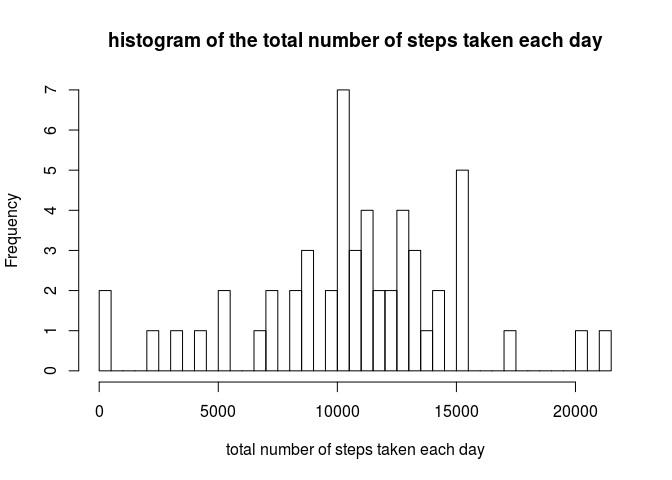
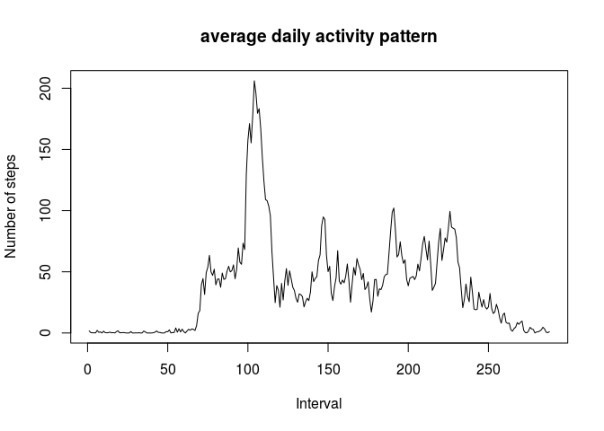
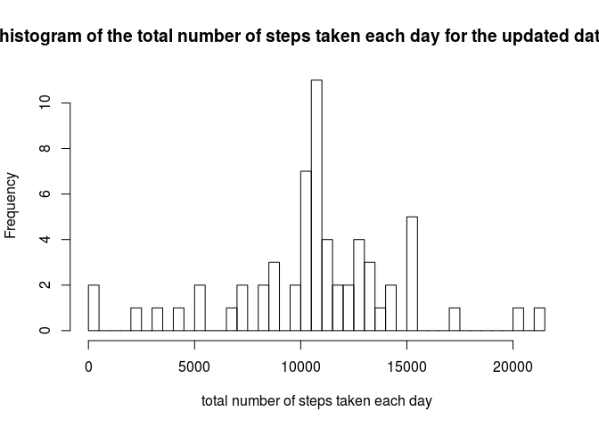
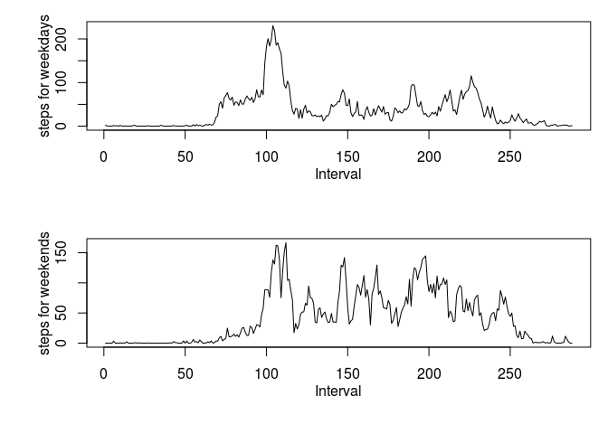

# Reproducible Research: Peer Assessment 1


## Loading and preprocessing the data
First unzip the file activity.zip. Then load the csv file.

```r
unzip("activity.zip")
activity <- read.csv("activity.csv")
```

## What is mean total number of steps taken per day?
Total number of steps taken per day is calculated by the following code

```r
stepsPERday <- tapply(activity$steps,activity$date, sum)
```
Histogram of the total number of steps taken each day is given by

```r
histbb <- hist(stepsPERday, breaks=60, xlab = "total number of steps taken each day", main = 'histogram of the total number of steps taken each day')
```

 


Mean and median of the total number of steps taken per day is calculated as

```r
meansteps <- mean(stepsPERday,na.rm = TRUE)
mediansteps <- median(stepsPERday,na.rm = TRUE)
```

Mean of the total number of steps taken per day is 1.0766189\times 10^{4}.

Median of the total number of steps taken per day is 10765.

## What is the average daily activity pattern?
Time series plot of the 5-minute interval and the average number of steps taken, averaged across all days is the following

```r
stepsPERinterval <- tapply(activity$steps,activity$interval, mean, na.rm= TRUE)
plot(stepsPERinterval, type = "l", xlab="Interval", ylab="Number of steps", main = "average daily activity pattern" )
```

 


104^th^ 5-minute interval, on average across all the days in the dataset, contains the maximum number of steps.

## Imputing missing values
Total number of missing values in the dataset is calculated by

```r
missingValues <- sum(is.na(activity$steps))
```
and is equal to 2304.

Lets fill in all the missing values in the dataset with the mean for that 5-minute interval and create new dataset

```r
naind <- is.na(activity$steps)
newactivity <- activity
newactivity$steps[naind] <- stepsPERinterval[as.character(newactivity$interval[naind])]
```

Histogram of the total number of steps taken each day is given by

```r
newstepsPERday <- tapply(newactivity$steps,newactivity$date, sum)
newhistbb <- hist(newstepsPERday, breaks=60, xlab = "total number of steps taken each day", main = 'histogram of the total number of steps taken each day for the updated dataset')
```

 


Mean and median of the total number of steps taken per day is calculated as

```r
newmeansteps <- mean(newstepsPERday)
newmediansteps <- median(newstepsPERday)
```
Mean of the total number of steps taken per day for the updated dataset is 1.0766189\times 10^{4}.
Median of the total number of steps taken per day for the updated dataset  is 1.0766189\times 10^{4}.
We did not observe any significant change when we replaced the missing values with the mean for that 5-minute interval.

## Are there differences in activity patterns between weekdays and weekends?

Lets create a new factor variable in the dataset with two levels – “weekday” and “weekend” indicating whether a given date is a weekday or weekend day.

```r
weekcol <- weekdays(as.Date(newactivity$date))
weekfact <- sapply(weekcol, function(x) if(x=="Cumartesi" | x=="Pazar"){ x<- "weekend"} else {x<-"weekday"} )
newdata <- cbind(newactivity, weekfactor = weekfact)
```

Panel plot containing a time series plot of the 5-minute interval and the average number of steps taken, averaged across all weekday days or weekend days is given by

```r
newdatasplit <- split(newdata, newdata$weekfactor)
dataweekday <- as.data.frame(newdatasplit$weekday)
dataweekend <- as.data.frame(newdatasplit$weekend)

stepsweekday <- tapply(dataweekday$steps, dataweekday$interval, mean)
stepsweekend <- tapply(dataweekend$steps, dataweekend$interval, mean)

par(mfrow=c(2,1), mai = c(1,1,0.25,0.2), mgp=c(2, 1, 0))
plot(stepsweekday, type = "l", xlab="Interval", ylab="steps for weekdays" )
plot(stepsweekend, type = "l", xlab="Interval", ylab="steps for weekends" )
```

 


For the weekdays data there is a dominant peak around 100^th^ interval while for the weekends data there are multiple of peaks distributed uniformly with comperable heights.
